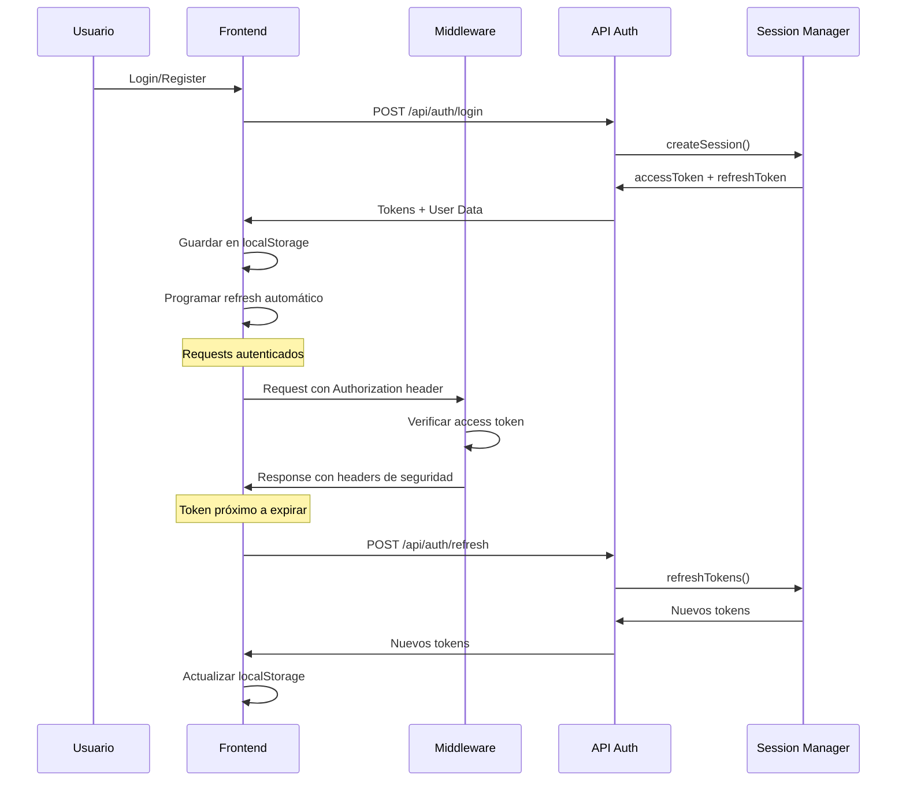

# 🔐 Guía de Seguridad - Sistema de Sesiones

## 📋 Resumen del Sistema

Este sistema implementa un manejo de sesiones seguro con las siguientes características:

### ✅ **Características de Seguridad**

- **Access Tokens de corta duración** (15 minutos)
- **Refresh Tokens de larga duración** (7 días)
- **Renovación automática** de tokens
- **Headers de seguridad** en todas las respuestas
- **Validación de roles** y permisos
- **Protección CSRF** y XSS
- **Rate limiting** configurable
- **Logout seguro** con invalidación de tokens

## 🚀 **Configuración Inicial**

### 1. **Variables de Entorno**

Copia el archivo `env.example` a `.env` y configura:

```bash
# Generar claves seguras
node -e "console.log(require('crypto').randomBytes(64).toString('hex'))"

# Configurar en .env
JWT_SECRET="tu-clave-generada-aqui"
JWT_REFRESH_SECRET="tu-clave-refresh-generada-aqui"
```

### 2. **Instalar Dependencias**

```bash
npm install jose
```

## 🔧 **Componentes del Sistema**

### **1. Middleware de Autenticación (`middleware.js`)**

- ✅ Protege rutas automáticamente
- ✅ Valida tokens en cada request
- ✅ Agrega headers de seguridad
- ✅ Maneja redirecciones para usuarios no autenticados
- ✅ Valida roles de administrador

### **2. Gestor de Sesiones (`session-manager.js`)**

- ✅ Genera access y refresh tokens
- ✅ Verifica tokens de forma segura
- ✅ Maneja renovación automática
- ✅ Valida permisos de usuario
- ✅ Invalida sesiones

### **3. Hook de Sesión (`useSession.js`)**

- ✅ Maneja estado de autenticación
- ✅ Renovación automática de tokens
- ✅ Requests autenticados automáticos
- ✅ Logout seguro
- ✅ Verificación de sesión al cargar

## 📊 **Flujo de Autenticación**



## 🛡️ **Medidas de Seguridad**

### **1. Headers de Seguridad**

```javascript
// Aplicados automáticamente por el middleware
'X-Frame-Options': 'DENY'
'X-Content-Type-Options': 'nosniff'
'Referrer-Policy': 'strict-origin-when-cross-origin'
'X-XSS-Protection': '1; mode=block'
'Strict-Transport-Security': 'max-age=31536000; includeSubDomains'
'Content-Security-Policy': "default-src 'self'; ..."
```

### **2. Validación de Tokens**

- ✅ Algoritmo HS256
- ✅ Issuer y Audience específicos
- ✅ Verificación de expiración
- ✅ Validación de tipo (access vs refresh)

### **3. Rate Limiting**

```javascript
// Configurable en variables de entorno
RATE_LIMIT_WINDOW="900000"  // 15 minutos
RATE_LIMIT_MAX_REQUESTS="100"  // 100 requests
```

### **4. Protección de Rutas**

```javascript
// Rutas protegidas
PROTECTED_ROUTES: ['/orders', '/cart', '/checkout', '/admin']

// Rutas de administrador
ADMIN_ROUTES: ['/admin']

// Rutas públicas
PUBLIC_ROUTES: ['/', '/catalog', '/contact', '/api/auth/*']
```

## 🔄 **Renovación Automática**

### **1. Detección de Expiración**

```javascript
// Verifica si el token expira en menos de 5 minutos
const isTokenNearExpiry = (token) => {
  const payload = JSON.parse(atob(token.split('.')[1]));
  const timeUntilExpiry = payload.exp - Math.floor(Date.now() / 1000);
  return timeUntilExpiry < 300; // 5 minutos
};
```

### **2. Refresh Automático**

```javascript
// Programado automáticamente
const scheduleTokenRefresh = (accessToken) => {
  const refreshTime = (timeUntilExpiry - 300) * 1000;
  setTimeout(() => refreshTokens(), refreshTime);
};
```

## 🚨 **Manejo de Errores**

### **1. Tokens Expirados**

```javascript
// Middleware maneja automáticamente
if (payload.exp < now) {
  return createErrorResponse('Token expirado', 401);
}
```

### **2. Refresh Token Inválido**

```javascript
// Logout automático
catch (error) {
  console.error('Error refrescando tokens:', error);
  logout(); // Limpia localStorage y redirige
}
```

## 📱 **Uso en Componentes**

### **1. Hook de Sesión**

```javascript
import { useSession } from '@/hooks/useSession';

function MyComponent() {
  const { user, isAuthenticated, login, logout, authenticatedFetch } = useSession();

  // Login
  const handleLogin = async (credentials) => {
    try {
      await login(credentials);
      // Redirigir o actualizar UI
    } catch (error) {
      // Manejar error
    }
  };

  // Request autenticado
  const fetchData = async () => {
    try {
      const response = await authenticatedFetch('/api/protected-route');
      const data = await response.json();
    } catch (error) {
      // Manejar error
    }
  };
}
```

### **2. Protección de Rutas**

```javascript
// El middleware protege automáticamente
// No necesitas código adicional en las páginas
```

## 🔍 **Monitoreo y Logs**

### **1. Logs de Seguridad**

```javascript
// Middleware logs
🔒 Middleware procesando: /orders
🔐 Verificando autenticación para: /orders
✅ Autenticación exitosa para usuario 123

// Session logs
🔄 Procesando refresh de token...
✅ Tokens refrescados exitosamente
🕐 Próximo refresh programado en 600 segundos
```

### **2. Métricas Recomendadas**

- Tasa de renovación de tokens
- Intentos de acceso no autorizado
- Errores de autenticación
- Tiempo de respuesta de APIs

## 🚀 **Despliegue en Producción**

### **1. Variables de Entorno**

```bash
# Generar claves únicas para producción
JWT_SECRET="clave-produccion-super-segura"
JWT_REFRESH_SECRET="clave-refresh-produccion-super-segura"

# Configurar HTTPS
NEXTAUTH_URL="https://tudominio.com"
CORS_ORIGIN="https://tudominio.com"
```

### **2. Headers de Seguridad Adicionales**

```javascript
// Agregar en next.config.mjs
const securityHeaders = [
  {
    key: 'X-DNS-Prefetch-Control',
    value: 'on'
  },
  {
    key: 'X-Permitted-Cross-Domain-Policies',
    value: 'none'
  }
];
```

## 🔧 **Mantenimiento**

### **1. Rotación de Claves**

- Cambiar `JWT_SECRET` y `JWT_REFRESH_SECRET` periódicamente
- Implementar blacklist de tokens antiguos
- Monitorear intentos de acceso con tokens expirados

### **2. Auditoría**

- Revisar logs de autenticación regularmente
- Monitorear patrones de uso anómalos
- Verificar headers de seguridad

## 📞 **Soporte**

Para problemas de seguridad:

1. Revisar logs del servidor
2. Verificar variables de entorno
3. Comprobar configuración de HTTPS
4. Validar headers de seguridad

---

**⚠️ IMPORTANTE**: Nunca compartas las claves JWT en código público o repositorios. Siempre usa variables de entorno.
